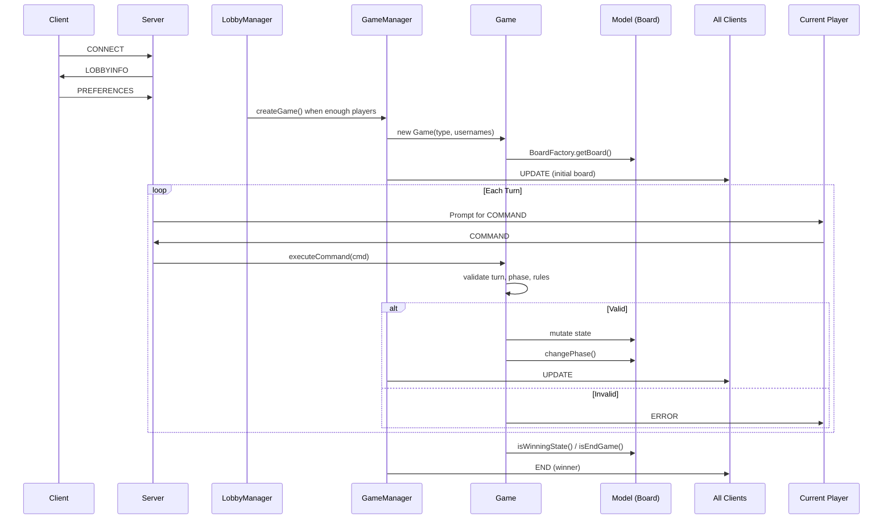

# ingsw2022-AM01


**Eriantys** — a digital adaptation of the board game by [Cranio Creations](https://craniocreations.it/en/product/eriantys/).

> Software Engineering project — Politecnico di Milano, A.Y. 2021/2022

Giovanni Arriciati, 10683631, giovanni.arriciati@mail.polimi.it.

Federico Arcelaschi, 10654781, federico.arcelaschi@mail.polimi.it

Lorenzo Aicardi, 10675881, lorenzo.aicardi@mail.polimi.it

---

## About the Game

*Eriantys* is a strategy board game for 2–4 players where each player controls a school of wizards and tries to conquer the islands around the board. Players move students, summon professors, place towers, and advance Mother Nature to gain influence over islands.

The Italian rulebook is included under `src/main/resources/rulebook_ITA.pdf`.

---

## Project specification

The project consists of a Java version of the board game *Eriantys*, made by Cranio Creations.

The final version includes:
* initial UML diagram;
* final UML diagram, generated from the code by automated tools;
* working game implementation, with full Expert rules;
* source code of the implementation;
* source code of unit tests.

---

## Features

The game supports two modes:

- **Simplified rules** — the base game without character cards.
- **Expert rules** — all 12 character cards with unique effects (Monk, Farmer, Guard, Mailman, Witch, Centaur, Jester, Knight, Cook, Storyteller, Queen, Taxman).

| Functionality         | Status |
|:----------------------|:------:|
| Simplified rules      | 🟢     |
| Expert rules          | 🟢     |
| 12 expert cards       | 🟢     |
| GUI                   | 🟢     |
| CLI                   | 🟢     |
| Multiple games        | 🟢     |
| 4 Players             | 🟢     |
| connection resiliency | 🔴     |
| game persistence      | 🔴     |

#### Legend
🔴 Not Implemented &nbsp; 🟢 Implemented

---

## Game Rules Summary

### Simplified Rules (Base Game)
- 2–4 players, each controls a wizard school
- **Phases per turn**: Planning → Action → Mother Nature → Cloud
- Move students from entrance → dining room → islands
- Summon professors by having most students of a color in dining room
- Place towers on islands where you have influence
- Advance Mother Nature to score islands
- Win by placing all towers or having most when game ends

### Expert Rules (Full Game)
- All base rules +
- **12 Character Cards** with unique effects:
  - **Monk**: Move student from entrance to dining room
  - **Farmer**: Move student from entrance to island
  - **Guard**: Block an island
  - **Mailman**: Swap students between entrance and dining room
  - **Witch**: Move student from island to entrance
  - **Centaur**: Move student from dining room to island
  - **Jester**: Copy another character's effect
  - **Knight**: Move Mother Nature extra steps
  - **Cook**: Convert student color in dining room
  - **Storyteller**: Look at cloud cards
  - **Queen**: Gain coins
  - **Taxman**: Steal coins from others
- Character cards cost coins, drawn from tavern

See full Italian rulebook: [rulebook_ITA.pdf](./src/main/resources/rulebook_ITA.pdf)

---

## Technology Stack

| Category      | Technology |
|:--------------|:-----------|
| Language      | Java 17 |
| Build System  | Apache Maven |
| GUI Framework | JavaFX 18.0.1 (with FXML) |
| Serialization | Gson 2.9.0 |
| Logging       | Log4j 2.17.2 |
| Testing       | JUnit Jupiter 5.8.2 |
| Coverage      | JaCoCo 0.8.7 |
| CI            | GitHub Actions (scheduled SonarQube analysis) |

---

## Architecture Overview

Client-server architecture with an MVC-like separation:

```
┌─────────────┐     TCP/JSON     ┌──────────────────┐
│  CLI / GUI  │ ◄─────────────►  │     Server       │
│  (View)     │     (Gson)       │  ┌────────────┐  │
└─────────────┘                  │  │ Controller │  │
                                 │  ├────────────┤  │
                                 │  │   Model    │  │
                                 │  └────────────┘  │
                                 └──────────────────┘
```

- **Model** — pure game logic (Board, Island, Turn, etc.) in `server.model`.
- **Controller** — `Game` class validates commands and updates the model.
- **Communication** — TCP socket, JSON-serialized messages via Gson with a polymorphic `Message` hierarchy.
- **View** — two implementations (`CLI` and `GUI`) sharing the `UserInterface` contract.
- **Protocol** — half-duplex; clients send `Command` objects on their turn, server broadcasts `Update` to all players.

Key design patterns: **Command**, **Strategy** (influence computation), **Factory** (board creation), **Adapter** (`GameInterface` bridges communication and controller), **DTO** (lightweight data objects for network transfer).

The server manages multiple concurrent games through `GameManager`. Lobbies are handled by `LobbyManager` before a game starts.

### Turn Flow Sequence



### Key Components Detail

- **`GameManager`** — Registry of active `GameInterface` instances; supports multiple concurrent games
- **`LobbyManager`** — Queues clients by `GameType` (2/3/4 players × base/expert); creates games when lobby fills
- **`GameInterface`** — Adapter bridging network `Client` handlers and controller `Game`; handles per-client messaging
- **`Game`** — Command validator & executor; enforces turn order, phase transitions, move limits (3 students for 2/4p, 4 for 3p)
- **`BoardFactory`** — Factory pattern: creates `Board` (base) or `ExpertBoard` based on `GameType.expertMode`
- **Strategy Pattern** — `InfluenceComputing` / `ProfessorComputing` interfaces allow base vs expert influence algorithms
- **DTOs** — `BoardData`, `IslandData`, `CastleData`, `CharacterData` etc. for network serialization (Gson)

---

## How to Build & Run

### Prerequisites

- Java 17 JDK
- Apache Maven

### Build

```bash
mvn clean package
```

The build produces a fat JAR (`AM01.jar` with `jar-with-dependencies`) in the `target/` directory, with all dependencies included.

### Run

```bash
# Start the server (port 12345)
java -jar target/AM01.jar server

# Graphical client
java -jar target/AM01.jar g-client

# Textual client (CLI)
java -jar target/AM01.jar t-client
# or
java -jar target/AM01.jar tc
```

A pre-built JAR and platform-specific launch scripts are also available under `Deliveries/play/`:

| Script | Description |
|:-------|:------------|
| `serverEriantys.sh` | Launches the server |
| `GraphicalClient.sh` | Launches the GUI client |
| `TextualClient.sh` | Launches the CLI client |

---

## Development Setup

### IDE Configuration
- **IntelliJ IDEA**: Open as Maven project, enable JavaFX plugin
- **Eclipse**: Install m2e + e(fx)clipse

### Running Tests
```bash
# All tests
mvn test

# Single test class
mvn test -Dtest=BoardTest

# With coverage report
mvn verify
# Open target/site/jacoco/index.html
```

### Code Style
- Google Java Format / IntelliJ default formatter
- Run `mvn compile` to verify

---

## Testing & Coverage

```bash
mvn test
```

Tests are written with **JUnit 5** (Jupiter). Coverage is measured with **JaCoCo**.

All tests in model and controller cover 88% of the model and controller.

Coverage reports are generated at `target/site/jacoco/index.html`.

---

## Project Scope Notes

This project was required to implement **one** of three advanced features:
- ✅ **4 Players** (implemented — supports 2, 3, and 4 players)
- ❌ Connection Resiliency (reconnection, state recovery)
- ❌ Game Persistence (save/load, database)

The two unimplemented features are marked 🔴 in the Features table as they were out of scope for this delivery.

---

## Project Structure

```
ingsw2022-AM01/
├── Deliveries/
│   ├── Communication Protocol/    # Protocol specification & examples
│   ├── Model UML/                 # Initial & final UML diagrams
│   ├── play/                      # Pre-built JAR & launch scripts
│   ├── Review del gruppo 31/      # Peer review of another group
│   └── Review del nostro lavoro/  # Reviews of this project
│
├── src/
│   ├── main/java/it/polimi/ingsw/
│   │   ├── startUp/               # Entry point (Main.java)
│   │   ├── server/
│   │   │   ├── communication/     # Server networking: TCP, lobby
│   │   │   ├── controller/        # Game controller: Game.java & helper classes
│   │   │   └── model/             # Business logic: base + expert
│   │   ├── communication/         # Shared protocol: messages, commands, DTOs
│   │   └── client/
│   │       ├── communication/     # Client networking
│   │       └── userInterface/     # CLI and GUI implementations
│   ├── main/resources/            # FXML, CSS, images, rulebook
│   └── test/java/it/polimi/ingsw/ # Unit tests
│
└── pom.xml                        # Maven build configuration
```

---

## UML Diagrams

Initial and final UML diagrams are located in (Deliveries/Model UML/)[./Deliveries/Model%20UML]:

- **Initial model/** — design-time UML (`class_diagram.mdj`, rendered as `.jpg`).
- **Final model/** — 7 diagrams auto-generated from the final code, covering:
  - Logic model
  - Communication protocol
  - Controller
  - User interfaces (CLI & GUI)
  - Model types / light model
  - Expert logic extensions

---

## Communication Protocol

The full protocol specification is documented in `Deliveries/Communication Protocol/`:

- [`communication protocol design.md`](./Deliveries/Communication%20Protocol/communication%20protocol%20design.md)
- [`communication protocol use case with examples.txt`](./Deliveries/Communication%20Protocol/communication%20protocol%20use%20case%20with%20examples.txt)

Key characteristics:
- **Transport**: TCP
- **Serialization**: JSON (Gson with custom polymorphic adapter)
- **Flow**: half-duplex — server responds to client requests
- **Heartbeat**: Ping/Pong every 5–10 seconds for connection monitoring
- **Message types**: `PREFERENCES`, `PING`, `LOBBYINFO`, `COMMAND`, `UPDATE`, `ERROR`, `END`

### Protocol Quick Reference

#### Message Types
| Type | Direction | Description |
|------|-----------|-------------|
| `PREFERENCES` | C→S | Username, game mode (expert/base), player count |
| `LOBBYINFO` | S→C | Current lobby states per game type |
| `COMMAND` | C→S | Player action (see commands below) |
| `UPDATE` | S→C | Full board state broadcast |
| `ERROR` | S→C | Invalid command rejection |
| `PING`/`PONG` | S↔C | Heartbeat (5s interval, 5s timeout) |
| `END` | S→C | Game over, winner declared |

#### Command Types
| Command | Phase | Parameters |
|---------|-------|------------|
| `PLAY_CARD` | Planning | `cardId` (1-10) |
| `CHOOSE_CLOUD` | Cloud | `cloudId` (1-n) |
| `MOVE_STUDENT_TO_CASTLE` | Action | `students[]` (colors) |
| `MOVE_STUDENT_TO_ISLAND` | Action | `islandId`, `students[]` |
| `MOVE_MOTHER_NATURE` | Mother Nature | `shift` (1-3) |
| `PAY_CHARACTER` | Expert | `charId`, `islandId`, `students[]` |

Full spec: `Deliveries/Communication Protocol/communication protocol design.md`
